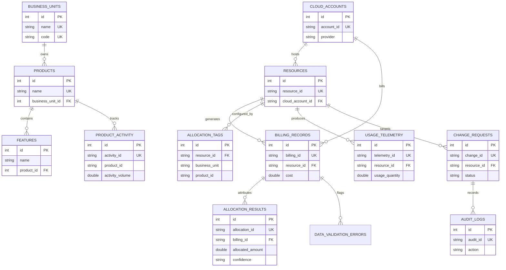

# Hospital Cloud Cost Attribution & Unit-Economics Dashboard

A FinOps intelligence dashboard designed for healthcare organizations to attribute multi-cloud infrastructure spend to business units, products, features, and clinical workloads with deterministic confidence scoring and defensive error handling.

---

## 🏛️ System Architecture

The platform uses a decoupled client-server architecture with an in-memory SQLite database and disk persistence:

```
[ React 19 Frontend (Tailwind CSS v4 + Motion) ]
                      │
                      ▼ (HTTP REST API / Vite Dev Server)
[ Express Backend Server (Node.js / tsx on Port 3000) ]
                      │
                      ├───────────────► [ 5-Tier Allocation Waterfall Engine ]
                      │                       (Direct -> Tag -> Telemetry -> Activity -> Unallocated)
                      │
                      └───────────────► [ SQLite Database Layer (sql.js) ]
                                              (data/hospital_finops.sqlite - 14 Tables)
```

### Technology Stack
- **Frontend**: React 19, TypeScript, Tailwind CSS v4, Motion (Framer Motion), Recharts, Lucide Icons.
- **Component Resilience**: React Error Boundary (`ErrorBoundary.tsx`), error fallback UI, credential masking, and four-state UI handling (`Loading`, `Success`, `Empty`, `Error`).
- **Backend API**: Node.js, Express, SQLite (`sql.js` in-memory with file persistence to `data/hospital_finops.sqlite`).
- **Attribution Engine**: 5-tiered waterfall processing pipeline executing rule matching, proportional usage telemetry, and activity-volume splits.
- **Governance**: Role-Based Access Control (`EXECUTIVE`, `FINOPS_ANALYST`, `PRODUCT_OWNER`), two-person approval workflows for tag reassignments, operational rollback, and immutable audit logging.

---

## 🔌 API Endpoint Documentation

Base API Path: `/api` | Data Format: `JSON` | Server Port: `3000`

### Complete Endpoint Reference Table

| Method | Endpoint Path | Purpose | Parameters | Response | Status Codes |
| :--- | :--- | :--- | :--- | :--- | :--- |
| `GET` | `/api/health` | Server health check and timestamp | None | JSON object | `200` |
| `GET` | `/api/dashboard` | Executive KPIs, spend breakdowns & trend | `bu`, `product`, `account`, `service`, `dateRange` | JSON object | `200`, `500` |
| `GET` | `/api/forecasting` | Historical run-rate & budget forecast | None | JSON object | `200`, `500` |
| `GET` | `/api/optimization` | Cost-saving opportunities list | None | JSON object | `200`, `500` |
| `GET` | `/api/costs` | Raw cloud billing export line items | None | JSON array | `200`, `500` |
| `GET` | `/api/business-units` | Business units spend summary & product count | None | JSON array | `200`, `500` |
| `GET` | `/api/products` | Clinical products list with feature costs | None | JSON array | `200`, `500` |
| `GET` | `/api/features` | Granular features list with product costs | None | JSON array | `200`, `500` |
| `GET` | `/api/cloud-accounts` | Cloud accounts list with spend & resources | None | JSON array | `200`, `500` |
| `GET` | `/api/services` | Cloud services list with spend totals | None | JSON array | `200`, `500` |
| `GET` | `/api/allocation` | Paginated allocation results with filters | `bu`, `product`, `method`, `confidence`, `status`, `search`, `limit`, `offset` | JSON object | `200`, `500` |
| `GET` | `/api/allocation/:id` | Single allocation result details | `id` (path) | JSON object | `200`, `404`, `500` |
| `GET` | `/api/evidence/:id` | Full mathematical audit evidence chain | `id` (path) | JSON object | `200`, `404`, `500` |
| `GET` | `/api/data-quality` | Dataset health reports & validation errors | None | JSON object | `200`, `500` |
| `GET` | `/api/data-freshness` | Data freshness age (hours) & SLA status | None | JSON object | `200`, `500` |
| `GET` | `/api/unit-economics` | Workload unit costs & monthly trend | None | JSON object | `200`, `500` |
| `GET` | `/api/experiment` | Baseline vs treatment experiment summary | None | JSON object | `200`, `500` |
| `POST` | `/api/experiment/run` | Execute FinOps A/B allocation experiment | None | JSON object | `200`, `500` |
| `GET` | `/api/anomalies` | Cost anomaly detections (>25% spike) | None | JSON array | `200`, `500` |
| `GET` | `/api/recommendations` | FinOps optimization recommendations | None | JSON array | `200`, `500` |
| `GET` | `/api/audit` | Immutable audit log trail | None | JSON array | `200`, `500` |
| `GET` | `/api/change-requests` | List allocation change requests | None | JSON array | `200`, `500` |
| `POST` | `/api/change-requests` | Submit tag reassignment request | Body (JSON) | JSON object | `201`, `400`, `500` |
| `POST` | `/api/change-requests/:id/approve` | Approve request (FinOps Analyst required) | `id` (path), Body (JSON) | JSON object | `200`, `400`, `500` |
| `POST` | `/api/change-requests/:id/reject` | Reject request (FinOps Analyst required) | `id` (path), Body (JSON) | JSON object | `200`, `400`, `500` |
| `POST` | `/api/change-requests/:id/rollback` | Rollback request (FinOps Analyst required) | `id` (path), Body (JSON) | JSON object | `200`, `400`, `500` |

---

### Key API Payload Examples

#### GET `/api/dashboard`
**Response (HTTP 200)**:
```json
{
  "kpis": {
    "totalCost": 724892.6,
    "allocatedCost": 671034.6,
    "unallocatedCost": 53858.0,
    "allocationRate": 92.57,
    "targetAllocationPct": 85.0,
    "gapToTarget": -7.57,
    "freshnessStatus": "FRESH",
    "dataQualityScore": 98.2
  },
  "spendByBU": [{ "business_unit": "Radiology", "cost": 312450.0 }],
  "spendByProduct": [{ "product_id": "Medical Imaging Platform", "cost": 312450.0 }],
  "confidenceBreakdown": [{ "confidence": "HIGH", "cost": 498200.0, "count": 1450 }],
  "methodBreakdown": [{ "allocation_method": "DIRECT", "cost": 420000.0, "count": 1200 }]
}
```

#### POST `/api/change-requests`
**Request Body**:
```json
{
  "requester": "sarah.jenkins@hospital.org",
  "role": "PRODUCT_OWNER",
  "product": "Medical Imaging Platform",
  "business_unit": "Radiology",
  "resource_id": "res-img-comp-004",
  "proposed_allocation": "Clinical Analytics / Clinical Analytics Platform",
  "reason": "GPU cluster reassigned for clinical model training."
}
```
**Response (HTTP 201)**:
```json
{
  "id": 1,
  "change_id": "CR-123456",
  "requester": "sarah.jenkins@hospital.org",
  "role": "PRODUCT_OWNER",
  "product": "Medical Imaging Platform",
  "business_unit": "Radiology",
  "resource_id": "res-img-comp-004",
  "old_allocation": "Radiology / Medical Imaging Platform",
  "proposed_allocation": "Clinical Analytics / Clinical Analytics Platform",
  "cost_impact": 8250.0,
  "reason": "GPU cluster reassigned for clinical model training.",
  "created_at": "2026-09-28T18:00:00.000Z",
  "status": "PENDING_REVIEW"
}
```

---

## 🛢️ Database Schema & Architecture

The database is an SQLite store (`data/hospital_finops.sqlite`) managed via `sql.js`.

### 1. Database Tables Reference

1. **`business_units`**: Top-level hospital departments.
   - Primary Key: `id` (`INTEGER AUTOINCREMENT`)
   - Unique Columns: `name` (`TEXT`), `code` (`TEXT`)
   - Other Columns: `description` (`TEXT`), `lead_manager` (`TEXT`)
2. **`products`**: Clinical software platforms owned by business units.
   - Primary Key: `id` (`INTEGER AUTOINCREMENT`)
   - Foreign Key: `business_unit_id` -> `business_units(id)`
   - Unique Columns: `name` (`TEXT`), `code` (`TEXT`)
3. **`features`**: Functional platform modules.
   - Primary Key: `id` (`INTEGER AUTOINCREMENT`)
   - Foreign Key: `product_id` -> `products(id)`
   - Columns: `name` (`TEXT`), `code` (`TEXT`), `description` (`TEXT`)
4. **`cloud_accounts`**: Cloud provider accounts (`ACCT-IMAGING`, `ACCT-SHARED`, etc.).
   - Primary Key: `id` (`INTEGER AUTOINCREMENT`)
   - Unique Column: `account_id` (`TEXT`)
   - Columns: `name` (`TEXT`), `provider` (`TEXT`), `environment` (`TEXT`)
5. **`resources`**: Cloud infrastructure inventory.
   - Primary Key: `id` (`INTEGER AUTOINCREMENT`)
   - Unique Column: `resource_id` (`TEXT`)
   - Columns: `cloud_account_id` (`TEXT`), `service` (`TEXT`), `region` (`TEXT`), `usage_type` (`TEXT`)
6. **`billing_records`**: Raw ingested cloud line items.
   - Primary Key: `id` (`INTEGER AUTOINCREMENT`)
   - Unique Column: `billing_id` (`TEXT`)
   - Columns: `billing_date` (`TEXT`), `cloud_provider` (`TEXT`), `cloud_account_id` (`TEXT`), `service` (`TEXT`), `region` (`TEXT`), `resource_id` (`TEXT`), `usage_type` (`TEXT`), `cost` (`REAL`), `currency` (`TEXT`), `allocation_tag` (`TEXT`), `product_id` (`TEXT`), `feature_id` (`TEXT`), `business_unit` (`TEXT`), `billing_status` (`TEXT`), `timestamp` (`TEXT`)
7. **`usage_telemetry`**: Telemetry points for Level 3 proportional usage splits.
   - Primary Key: `id` (`INTEGER AUTOINCREMENT`)
   - Unique Column: `telemetry_id` (`TEXT`)
   - Columns: `timestamp` (`TEXT`), `cloud_account_id` (`TEXT`), `resource_id` (`TEXT`), `product_id` (`TEXT`), `feature_id` (`TEXT`), `business_unit` (`TEXT`), `usage_type` (`TEXT`), `usage_quantity` (`REAL`), `unit` (`TEXT`), `freshness_timestamp` (`TEXT`)
8. **`allocation_tags`**: IaC governance tags (Level 2).
   - Primary Key: `id` (`INTEGER AUTOINCREMENT`)
   - Columns: `resource_id` (`TEXT`), `cloud_account_id` (`TEXT`), `business_unit` (`TEXT`), `product_id` (`TEXT`), `feature_id` (`TEXT`), `allocation_status` (`TEXT`), `tag_last_updated` (`TEXT`), `tag_source` (`TEXT`)
9. **`product_activity`**: Monthly clinical workload volume metrics (Level 4).
   - Primary Key: `id` (`INTEGER AUTOINCREMENT`)
   - Unique Column: `activity_id` (`TEXT`)
   - Columns: `date` (`TEXT`), `business_unit` (`TEXT`), `product_id` (`TEXT`), `feature_id` (`TEXT`), `activity_type` (`TEXT`), `activity_volume` (`REAL`), `unit` (`TEXT`)
10. **`allocation_results`**: Engine output records.
    - Primary Key: `id` (`INTEGER AUTOINCREMENT`)
    - Unique Column: `allocation_id` (`TEXT`)
    - Columns: `billing_id` (`TEXT`), `business_unit` (`TEXT`), `product_id` (`TEXT`), `feature_id` (`TEXT`), `allocated_amount` (`REAL`), `allocation_method` (`TEXT`), `confidence` (`TEXT`), `evidence_source` (`TEXT`), `evidence_timestamp` (`TEXT`), `allocation_status` (`TEXT`), `reason` (`TEXT`)
11. **`audit_logs`**: Governance audit trail.
    - Primary Key: `id` (`INTEGER AUTOINCREMENT`)
    - Unique Column: `audit_id` (`TEXT`)
    - Columns: `timestamp` (`TEXT`), `user` (`TEXT`), `role` (`TEXT`), `action` (`TEXT`), `object_type` (`TEXT`), `object_id` (`TEXT`), `old_value` (`TEXT`), `new_value` (`TEXT`), `reason` (`TEXT`), `status` (`TEXT`), `impact_amount` (`REAL`)
12. **`change_requests`**: Allocation tag workflow change requests.
    - Primary Key: `id` (`INTEGER AUTOINCREMENT`)
    - Unique Column: `change_id` (`TEXT`)
    - Columns: `requester` (`TEXT`), `role` (`TEXT`), `product` (`TEXT`), `business_unit` (`TEXT`), `resource_id` (`TEXT`), `old_allocation` (`TEXT`), `proposed_allocation` (`TEXT`), `cost_impact` (`REAL`), `reason` (`TEXT`), `created_at` (`TEXT`), `status` (`TEXT`), `reviewer` (`TEXT`), `reviewed_at` (`TEXT`), `previous_state_json` (`TEXT`)
13. **`experiments`**: FinOps A/B experiment telemetry.
    - Primary Key: `id` (`INTEGER AUTOINCREMENT`)
    - Columns: `run_at` (`TEXT`), `baseline_total_cost` (`REAL`), `baseline_allocated_cost` (`REAL`), `baseline_unallocated_cost` (`REAL`), `baseline_allocation_pct` (`REAL`), `treatment_total_cost` (`REAL`), `treatment_allocated_cost` (`REAL`), `treatment_unallocated_cost` (`REAL`), `treatment_allocation_pct` (`REAL`), `target_allocation_pct` (`REAL`), `pp_improvement` (`REAL`), `rel_improvement_pct` (`REAL`), `status` (`TEXT`)
14. **`data_validation_errors`**: Validation error records (`DUPLICATE_BILLING`, `MISSING_ALLOCATION_TAG`, `STALE_TELEMETRY`, `INVALID_PRODUCT_ID`, `CONFLICTING_TAGS`).
    - Primary Key: `id` (`INTEGER AUTOINCREMENT`)
    - Columns: `record_id` (`TEXT`), `source` (`TEXT`), `field` (`TEXT`), `issue_type` (`TEXT`), `reason` (`TEXT`), `affected_cost` (`REAL`), `timestamp` (`TEXT`)

---

### 2. Entity-Relationship (ER) Diagram



---

## 🛡️ React Error Boundaries & Failure Handling

### 1. React Error Boundary Component (`ErrorBoundary.tsx`)
- **Rendering Crash Interception**: Prevents uncaught child component errors from blanking out the entire SPA layout.
- **Fallback UI**: Renders a dedicated error shield card with a **"Retry View Component"** button and a **"Reload Application"** option.
- **Credential Masking**: Redacts secrets, API keys, and internal environment variables from rendered error messages.
- **Development Diagnostics**: In development mode, provides component stack traces for rapid debugging.

### 2. Defensive Backend & Pipeline Error Handlers
- **Validation Log**: Captures duplicate billing records, stale telemetry, missing tags, conflicting tags, and invalid product tags in `data_validation_errors`.
- **View States**: Frontend pages handle `Loading`, `Success`, `Empty`, and `Error` UI states gracefully.

---

## 🌊 Attribution Waterfall & Mathematical Model

The allocation engine processes billing line items through a 5-tier waterfall:

1. **Level 1 — Direct Billing Tag**: Direct match on billing export tags (\(C_{\text{final}} = 1.0 \implies \mathbf{HIGH}\)).
2. **Level 2 — Resource Tag (IaC)**: Match on IaC resource tags (\(C_{\text{final}} = 1.0 \implies \mathbf{HIGH}\)). Conflicting tags or invalid product tags enter the unallocated pool (\(C_{\text{final}} = 0.0 \implies \mathbf{NONE}\)).
3. **Level 3 — Usage Telemetry**: Proportional usage split (\(\text{Alloc}_i = \text{Cost} \times \frac{\text{Usage}_i}{\sum \text{Usage}_j}\)). Fresh telemetry (\(\le 72\text{h}\)) maps to \(\mathbf{MEDIUM}\); stale telemetry (\(> 72\text{h}\)) downgrades to \(\mathbf{LOW}\).
4. **Level 4 — Product Business Activity**: Shared account split based on clinical workload volume (\(C_{\text{final}} = 0.70 \implies \mathbf{MEDIUM}\)).
5. **Level 5 — Unallocated Pool**: Untagged fallback pool (\(C_{\text{final}} = 0.0 \implies \mathbf{NONE}\)).

Confidence Formula:

\[
C_{\text{final}} = C_{\text{base}} \times Q \times F \times E
\]

---

## 🧪 Unit & Integration Testing Strategy

Automated test coverage is provided via **Vitest** (25 total tests across 5 test files):

```
tests/
├── unit/
│   ├── confidence.test.ts      # 7 tests: Waterfall levels & confidence equations
│   ├── unit-economics.test.ts  # 3 tests: Unit costs & zero-volume safety
│   ├── analytics.test.ts       # 5 tests: Anomalies, quality, freshness, recommendations
│   └── error-boundary.test.ts  # 2 tests: ErrorBoundary state & console logging
└── integration/
    └── pipeline.test.ts        # 8 tests: End-to-end failure handlers & deduplication
```

### Key Tested Scenarios
- **Duplicate Billing Ingestion**: Duplicate records flag `DUPLICATE_BILLING` in `data_validation_errors`, cost counted once.
- **Schema Drift Safety**: Invalid record schemas enter the unallocated pool without crashing.
- **Stale Telemetry**: Telemetry > 72h triggers `STALE_TELEMETRY` and reduces confidence to LOW.
- **Zero Activity Safety**: Volume = 0 returns a safe unit cost metric (0.0) without `NaN`/`Infinity`.
- **Cost Conservation**: Shared infrastructure splits conserve total cost (\(\sum \text{Alloc}_i = \text{BilledCost}\)).
- **Cost Spike Anomaly**: Spend jumps > 25% above 5-month moving average and > $200 raise HIGH severity alerts.

---

## 📚 Technical Documentation Links

- [📄 Database Schema Documentation](docs/DATABASE_SCHEMA.md)
- [📊 Entity-Relationship (ER) Diagram](docs/ER_DIAGRAM.md)
- [🔌 API Endpoint Contracts](docs/API_CONTRACTS.md)
- [🧮 Mathematical Model & Confidence Scoring](docs/CONFIDENCE_SCORING.md)
- [🧪 Testing Strategy & Execution Report](docs/TESTING.md)

---

## 🚀 Getting Started

### Prerequisites
- Node.js (v18 or higher)
- npm or bun

### Setup & Run Commands

1. **Install dependencies**:
   ```bash
   npm install
   ```

2. **Seed synthetic data & run allocation**:
   ```bash
   npm run seed
   ```

3. **Run unit & integration test suite**:
   ```bash
   npm test
   ```

4. **Start development server**:
   ```bash
   npm run dev
   ```
   Open `http://localhost:3000` in your browser.

5. **Build production bundle**:
   ```bash
   npm run build
   ```

---

## 🔒 Privacy & Compliance

All datasets used in this repository are **100% synthetic**. No real patient health information (PHI) or confidential medical data is present.
