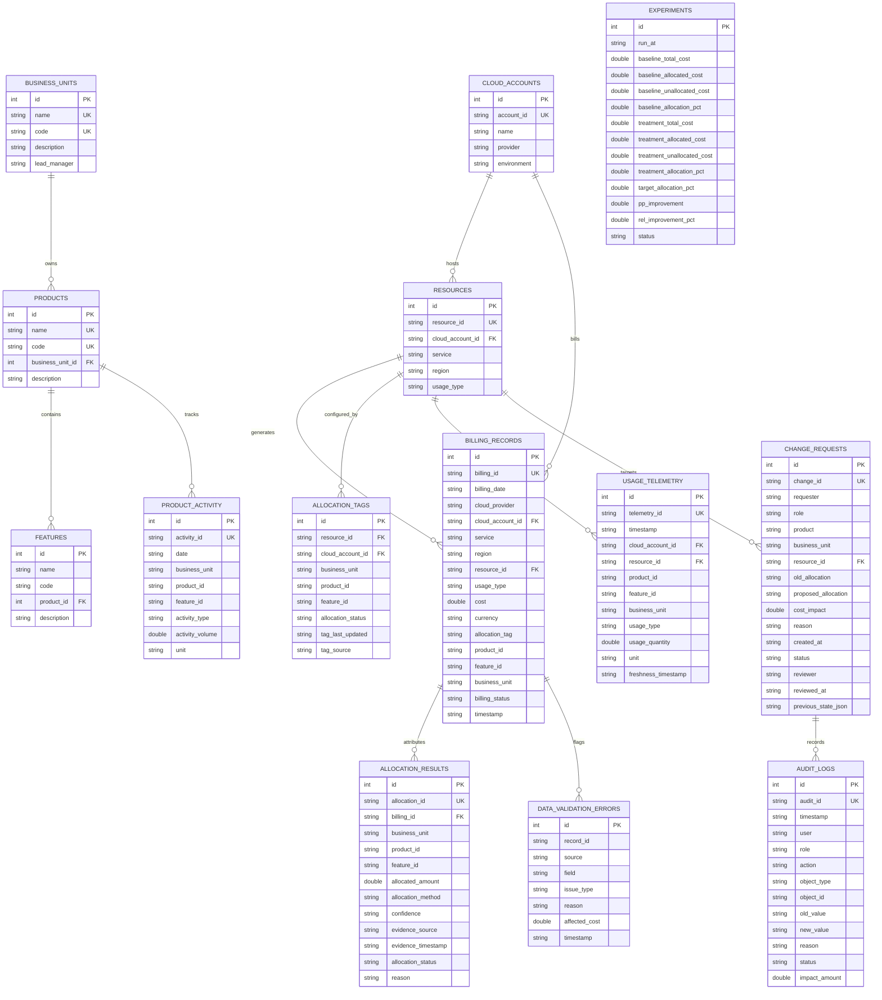

# Hospital Cloud Cost Attribution & Unit-Economics Dashboard
## Entity-Relationship (ER) Diagram

### 1. Overview

The following Entity-Relationship diagram documents all entities and relationships in the `hospital_finops.sqlite` database schema.

---

### 2. Mermaid ER Diagram

---

### 3. Entity Relationships Summary

1. **Organizational Hierarchy**:
   - `BUSINESS_UNITS` owns 1:N `PRODUCTS`.
   - `PRODUCTS` contains 1:N `FEATURES`.

2. **Infrastructure & Billing**:
   - `CLOUD_ACCOUNTS` hosts 1:N `RESOURCES`.
   - `CLOUD_ACCOUNTS` generates 1:N `BILLING_RECORDS`.
   - `RESOURCES` relates 1:N to `BILLING_RECORDS`, `ALLOCATION_TAGS`, `USAGE_TELEMETRY`, and `CHANGE_REQUESTS`.

3. **Attribution Engine Outputs**:
   - `BILLING_RECORDS` maps 1:N to `ALLOCATION_RESULTS` (each line item is attributed to business units/products).
   - `BILLING_RECORDS` and `ALLOCATION_TAGS` generate `DATA_VALIDATION_ERRORS` for anomalies, duplicate billing, stale telemetry, missing tags, or conflicting tags.

4. **Governance & Audit**:
   - `CHANGE_REQUESTS` targets specific resources and produces `AUDIT_LOGS` entries for approval, rejection, and operational rollback.
